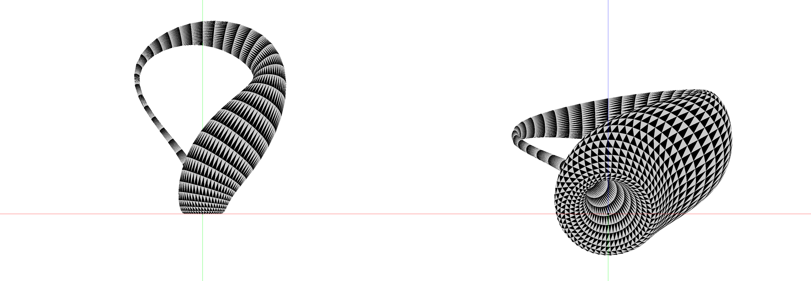

Informática Gráfica
=============================================

Teclas
---------------------------------------------
  * <kbd>&nbsp;</kbd> (tecla espacio): Cambia de objeto
  * <kbd>A</kbd>: Modo de visualización de puntos
  * <kbd>S</kbd>: Modo de visualización de líneas
  * <kbd>D</kbd>: Modo de visualización de relleno
  * <kbd>F</kbd>: Modo de visualización de ajedrez
  * <kbd>1</kbd>-<kbd>9</kbd>,<kbd>0</kbd>: Modifica el número de triángulos usados en las mallas con precisión ajustable
  * <kbd>P</kbd>: Cambia de práctica

  * <kbd>G</kbd>: Rota el grado de libertad
  * <kbd><</kbd>: Disminuye el valor del grado de libertad activo
  * <kbd>></kbd>: Aumenta el valor del grado de libertad activo
  * <kbd>Z</kbd>: Aumenta o disminuye el primer grado de libertad (según se pulse [MAYUS])
  * <kbd>X</kbd>: Aumenta o disminuye el segundo grado de libertad (según se pulse [MAYUS])
  * <kbd>C</kbd>: Aumenta o disminuye el tercer grado de libertad (según se pulse [MAYUS])
  * <kbd>V</kbd>: Aumenta o disminuye el cuarto grado de libertad (según se pulse [MAYUS])
